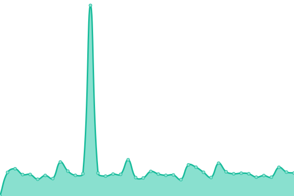
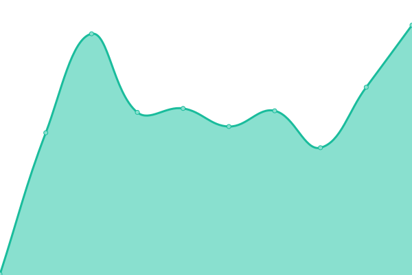
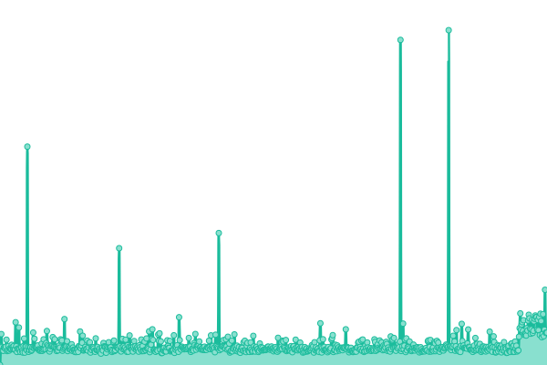
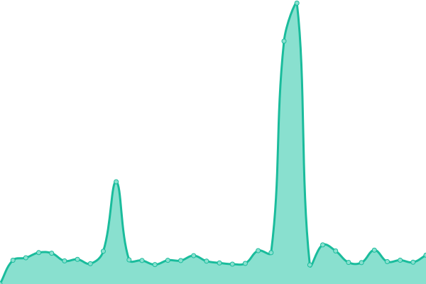
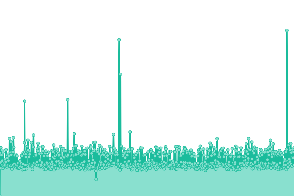
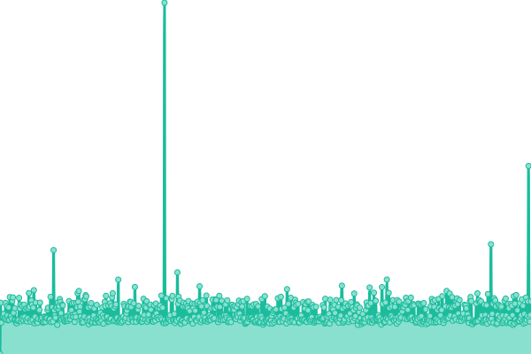
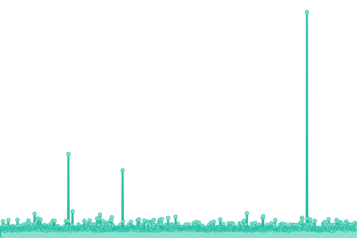
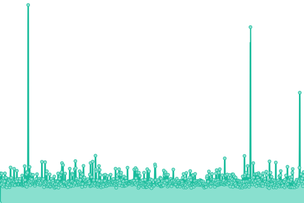

# [📈 Live Status](https://uptime.keypersafe.xyz): <!--live status--> **🟩 All systems operational**

This repository contains the open-source uptime monitor and status page for [Palmera Dao Backend](https://palmeradao.xyz), powered by [Upptime](https://github.com/upptime/upptime).

With [Upptime](https://upptime.js.org), you can get your own unlimited and free uptime monitor and status page, powered entirely by a GitHub repository. We use [Issues](https://github.com/keyper-labs/palmera-services-status/issues) as incident reports, [Actions](https://github.com/keyper-labs/palmera-services-status/actions) as uptime monitors, and [Pages](https://uptime.keypersafe.xyz) for the status page.

<!--start: status pages-->
<!-- This summary is generated by Upptime (https://github.com/upptime/upptime) -->
<!-- Do not edit this manually, your changes will be overwritten -->
<!-- prettier-ignore -->
| URL | Status | History | Response Time | Uptime |
| --- | ------ | ------- | ------------- | ------ |
|  [Palmera Client Gateway](https://client-gateway-prod.keypersafe.xyz/health/ready/) | 🟩 Up | [palmera-client-gateway.yml](https://github.com/keyper-labs/palmera-services-status/commits/HEAD/history/palmera-client-gateway.yml) | 

 0ms
     
 | 

<a href="https://keyper-labs.github.io/palmera-services-status/history/palmera-client-gateway">100.00%</a>
    

|  [Palmera Tx Service (Mainnet)](https://prod.mainnet.transaction.keypersafe.xyz/check/) | 🟩 Up | [palmera-tx-service-mainnet.yml](https://github.com/keyper-labs/palmera-services-status/commits/HEAD/history/palmera-tx-service-mainnet.yml) | 

 0ms
     
 | 

<a href="https://keyper-labs.github.io/palmera-services-status/history/palmera-tx-service-mainnet">100.00%</a>
    

|  [Palmera Tx Service (Gnosis Chain)](https://prod.gnosis.keypersafe.xyz/check/) | 🟩 Up | [palmera-tx-service-gnosis-chain.yml](https://github.com/keyper-labs/palmera-services-status/commits/HEAD/history/palmera-tx-service-gnosis-chain.yml) | 

 0ms
     
 | 

<a href="https://keyper-labs.github.io/palmera-services-status/history/palmera-tx-service-gnosis-chain">100.00%</a>
    

|  [Palmera Tx Service (Sepolia)](https://dev.sepolia2.transaction.keypersafe.xyz/check/) | 🟩 Up | [palmera-tx-service-sepolia.yml](https://github.com/keyper-labs/palmera-services-status/commits/HEAD/history/palmera-tx-service-sepolia.yml) | 

 0ms
     
 | 

<a href="https://keyper-labs.github.io/palmera-services-status/history/palmera-tx-service-sepolia">100.00%</a>
    

|  [Palmera Tx Service (Polygon - Matic)](https://prod.polygon.transaction.keypersafe.xyz/check/) | 🟩 Up | [palmera-tx-service-polygon-matic.yml](https://github.com/keyper-labs/palmera-services-status/commits/HEAD/history/palmera-tx-service-polygon-matic.yml) | 

 0ms
     
 | 

<a href="https://keyper-labs.github.io/palmera-services-status/history/palmera-tx-service-polygon-matic">100.00%</a>
    

|  [Palmera Tx Service (Base Mainnet)](https://prod.base.keypersafe.xyz/check/) | 🟩 Up | [palmera-tx-service-base-mainnet.yml](https://github.com/keyper-labs/palmera-services-status/commits/HEAD/history/palmera-tx-service-base-mainnet.yml) | 

 0ms
     
 | 

<a href="https://keyper-labs.github.io/palmera-services-status/history/palmera-tx-service-base-mainnet">100.00%</a>
    

|  [Palmera Tx Service (Celo)](https://prod.celo.keypersafe.xyz/check/) | 🟩 Up | [palmera-tx-service-celo.yml](https://github.com/keyper-labs/palmera-services-status/commits/HEAD/history/palmera-tx-service-celo.yml) | 

 0ms
     
 | 

<a href="https://keyper-labs.github.io/palmera-services-status/history/palmera-tx-service-celo">100.00%</a>
    

|  [Palmera Tx Service (Arbitrum)](https://prod.arbitrum.keypersafe.xyz/check/) | 🟩 Up | [palmera-tx-service-arbitrum.yml](https://github.com/keyper-labs/palmera-services-status/commits/HEAD/history/palmera-tx-service-arbitrum.yml) | 

 0ms
     
 | 

<a href="https://keyper-labs.github.io/palmera-services-status/history/palmera-tx-service-arbitrum">100.00%</a>
    

|  [Palmera Tx Service (Optimism)](https://prod.optimism.keypersafe.xyz/check/) | 🟩 Up | [palmera-tx-service-optimism.yml](https://github.com/keyper-labs/palmera-services-status/commits/HEAD/history/palmera-tx-service-optimism.yml) | 

 0ms
     
 | 

<a href="https://keyper-labs.github.io/palmera-services-status/history/palmera-tx-service-optimism">100.00%</a>
    

|  [Palmera Tx Service (Treasure)](https://prod.treasure.keypersafe.xyz/check/) | 🟩 Up | [palmera-tx-service-treasure.yml](https://github.com/keyper-labs/palmera-services-status/commits/HEAD/history/palmera-tx-service-treasure.yml) | 

 0ms
     
 | 

<a href="https://keyper-labs.github.io/palmera-services-status/history/palmera-tx-service-treasure">100.00%</a>
    

|  [Palmera Tx Service (Arthera)](https://prod.arthera.transaction.keypersafe.xyz/check/) | 🟩 Up | [palmera-tx-service-arthera.yml](https://github.com/keyper-labs/palmera-services-status/commits/HEAD/history/palmera-tx-service-arthera.yml) | 

 0ms
     
 | 

<a href="https://keyper-labs.github.io/palmera-services-status/history/palmera-tx-service-arthera">100.00%</a>
    

<!--end: status pages-->

[**Visit our status website →**](https://uptime.keypersafe.xyz)

## 📄 License

- Powered by: [Upptime](https://github.com/upptime/upptime)
- Code: [MIT](./LICENSE) © [Palmera Dao](https://palmeradao.xyz)
- Data in the `./history` directory: [Open Database License](https://opendatacommons.org/licenses/odbl/1-0/)
