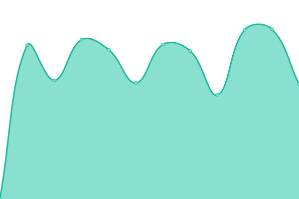

# [📈 Live Status](https://uptime.keypersafe.xyz): <!--live status--> **🟩 All systems operational**

This repository contains the open-source uptime monitor and status page for [Palmera Infrastructure](https://palmeradao.xyz), powered by [Upptime](https://github.com/upptime/upptime).

With [Upptime](https://upptime.js.org), you can get your own unlimited and free uptime monitor and status page, powered entirely by a GitHub repository. We use [Issues](https://github.com/keyper-labs/palmera-services-status/issues) as incident reports, [Actions](https://github.com/keyper-labs/palmera-services-status/actions) as uptime monitors, and [Pages](https://uptime.keypersafe.xyz) for the status page.

<!--start: status pages-->
<!-- This summary is generated by Upptime (https://github.com/upptime/upptime) -->
<!-- Do not edit this manually, your changes will be overwritten -->
<!-- prettier-ignore -->
| URL | Status | History | Response Time | Uptime |
| --- | ------ | ------- | ------------- | ------ |
|  [Palmera Tx Service (Chronicle Yellowstone Testnet)](https://prod.chronicle-yellowstone.keypersafe.xyz/check/) | 🟩 Up | [palmera-tx-service-chronicle-yellowstone-testnet.yml](https://github.com/keyper-labs/palmera-services-status/commits/HEAD/history/palmera-tx-service-chronicle-yellowstone-testnet.yml) | 

 223ms
     
 | 

<a href="https://status.palmeradao.xyz/history/palmera-tx-service-chronicle-yellowstone-testnet">100.00%</a>
    

|  [Palmera Tx Service (Lit Chain)](https://prod.lit-chain.keypersafe.xyz/check/) | 🟩 Up | [palmera-tx-service-lit-chain.yml](https://github.com/keyper-labs/palmera-services-status/commits/HEAD/history/palmera-tx-service-lit-chain.yml) | 

 231ms
     
 | 

<a href="https://status.palmeradao.xyz/history/palmera-tx-service-lit-chain">100.00%</a>
    

|  [Palmera Client Gateway (Lit Chain)](https://prod.lit-chain-client-gateway.keypersafe.xyz/health/ready/) | 🟩 Up | [palmera-client-gateway-lit-chain.yml](https://github.com/keyper-labs/palmera-services-status/commits/HEAD/history/palmera-client-gateway-lit-chain.yml) | 

 212ms
     
 | 

<a href="https://status.palmeradao.xyz/history/palmera-client-gateway-lit-chain">100.00%</a>
    

|  [Palmera Tx Service (XRPL Mainnet)](https://prod.xrpl-evm.keypersafe.xyz/check/) | 🟩 Up | [palmera-tx-service-xrpl-mainnet.yml](https://github.com/keyper-labs/palmera-services-status/commits/HEAD/history/palmera-tx-service-xrpl-mainnet.yml) | 

 209ms
     
 | 

<a href="https://status.palmeradao.xyz/history/palmera-tx-service-xrpl-mainnet">100.00%</a>
    

|  [Palmera Tx Service (XRPL Testnet)](https://prod.xrpl-evm-testnet.keypersafe.xyz/check/) | 🟩 Up | [palmera-tx-service-xrpl-testnet.yml](https://github.com/keyper-labs/palmera-services-status/commits/HEAD/history/palmera-tx-service-xrpl-testnet.yml) | 

 199ms
     
 | 

<a href="https://status.palmeradao.xyz/history/palmera-tx-service-xrpl-testnet">100.00%</a>
    

|  [Palmera Client Gateway (XRPL Client Gateway)](https://prod.xrpl-evm-client-gateway.keypersafe.xyz/health/ready/) | 🟩 Up | [palmera-client-gateway-xrpl-client-gateway.yml](https://github.com/keyper-labs/palmera-services-status/commits/HEAD/history/palmera-client-gateway-xrpl-client-gateway.yml) | 

 206ms
     
 | 

<a href="https://status.palmeradao.xyz/history/palmera-client-gateway-xrpl-client-gateway">100.00%</a>
    

|  [Palmera Tx Service (Z-Chain Testnet)](https://prod.zephyr.keypersafe.xyz/check/) | 🟩 Up | [palmera-tx-service-z-chain-testnet.yml](https://github.com/keyper-labs/palmera-services-status/commits/HEAD/history/palmera-tx-service-z-chain-testnet.yml) | 

 661ms
     
 | 

<a href="https://status.palmeradao.xyz/history/palmera-tx-service-z-chain-testnet">99.91%</a>
    

|  [Palmera Tx Service (Flare)](https://prod.flare.keypersafe.xyz/check/) | 🟩 Up | [palmera-tx-service-flare.yml](https://github.com/keyper-labs/palmera-services-status/commits/HEAD/history/palmera-tx-service-flare.yml) | 

 211ms
     
 | 

<a href="https://status.palmeradao.xyz/history/palmera-tx-service-flare">100.00%</a>
    

|  [Palmera Client Gateway (Flare)](https://prod.flare-client-gateway.keypersafe.xyz/health/ready/) | 🟩 Up | [palmera-client-gateway-flare.yml](https://github.com/keyper-labs/palmera-services-status/commits/HEAD/history/palmera-client-gateway-flare.yml) | 

 205ms
     
 | 

<a href="https://status.palmeradao.xyz/history/palmera-client-gateway-flare">100.00%</a>
    

|  [Palmera Tx Service (Goat Network)](https://prod.goat-network.keypersafe.xyz/check/) | 🟩 Up | [palmera-tx-service-goat-network.yml](https://github.com/keyper-labs/palmera-services-status/commits/HEAD/history/palmera-tx-service-goat-network.yml) | 

 198ms
     
 | 

<a href="https://status.palmeradao.xyz/history/palmera-tx-service-goat-network">100.00%</a>
    

|  [Palmera Client Gateway (Goat Network)](https://prod.goat-network-client-gateway.keypersafe.xyz/health/ready/) | 🟩 Up | [palmera-client-gateway-goat-network.yml](https://github.com/keyper-labs/palmera-services-status/commits/HEAD/history/palmera-client-gateway-goat-network.yml) | 

 201ms
     
 | 

<a href="https://status.palmeradao.xyz/history/palmera-client-gateway-goat-network">100.00%</a>
    

|  [Palmera Tx Service (Injective EVM Testnet)](https://prod.injectiveevm-testnet.keypersafe.xyz/check/) | 🟩 Up | [palmera-tx-service-injective-evm-testnet.yml](https://github.com/keyper-labs/palmera-services-status/commits/HEAD/history/palmera-tx-service-injective-evm-testnet.yml) | 

 205ms
     
 | 

<a href="https://status.palmeradao.xyz/history/palmera-tx-service-injective-evm-testnet">100.00%</a>
    

|  [Palmera Client Gateway (Injective EVM Testnet)](https://prod.injectiveevm-testnet-client-gateway.keypersafe.xyz/health/ready/) | 🟩 Up | [palmera-client-gateway-injective-evm-testnet.yml](https://github.com/keyper-labs/palmera-services-status/commits/HEAD/history/palmera-client-gateway-injective-evm-testnet.yml) | 

 209ms
     
 | 

<a href="https://status.palmeradao.xyz/history/palmera-client-gateway-injective-evm-testnet">100.00%</a>
    

|  [Palmera Tx Service (Neox)](https://prod.neox.transaction.keypersafe.xyz/check/) | 🟩 Up | [palmera-tx-service-neox.yml](https://github.com/keyper-labs/palmera-services-status/commits/HEAD/history/palmera-tx-service-neox.yml) | 

 204ms
     
 | 

<a href="https://status.palmeradao.xyz/history/palmera-tx-service-neox">100.00%</a>
    

|  [Palmera Client Gateway (Neox)](https://prod.neox-client-gateway.keypersafe.xyz/health/ready/) | 🟩 Up | [palmera-client-gateway-neox.yml](https://github.com/keyper-labs/palmera-services-status/commits/HEAD/history/palmera-client-gateway-neox.yml) | 

 210ms
     
 | 

<a href="https://status.palmeradao.xyz/history/palmera-client-gateway-neox">100.00%</a>
    

|  [Palmera Tx Service (Neox Testnet)](https://prod.neox-t.transaction.keypersafe.xyz/check/) | 🟩 Up | [palmera-tx-service-neox-testnet.yml](https://github.com/keyper-labs/palmera-services-status/commits/HEAD/history/palmera-tx-service-neox-testnet.yml) | 

 202ms
     
 | 

<a href="https://status.palmeradao.xyz/history/palmera-tx-service-neox-testnet">100.00%</a>
    

|  [Palmera Client Gateway (Zeronet)](https://prod.wl-client-gateway.keypersafe.xyz/health/ready/) | 🟩 Up | [palmera-client-gateway-zeronet.yml](https://github.com/keyper-labs/palmera-services-status/commits/HEAD/history/palmera-client-gateway-zeronet.yml) | 

 215ms
     
 | 

<a href="https://status.palmeradao.xyz/history/palmera-client-gateway-zeronet">100.00%</a>
    

|  [Palmera Tx Service (Zeronet)](https://prod.zeronet-mainnet.transaction.keypersafe.xyz/check/) | 🟩 Up | [palmera-tx-service-zeronet.yml](https://github.com/keyper-labs/palmera-services-status/commits/HEAD/history/palmera-tx-service-zeronet.yml) | 

 204ms
     
 | 

<a href="https://status.palmeradao.xyz/history/palmera-tx-service-zeronet">99.94%</a>
    

|  [Palmera Tx Service (Somnia Testnet)](https://prod.somnia-testnet.keypersafe.xyz/check/) | 🟩 Up | [palmera-tx-service-somnia-testnet.yml](https://github.com/keyper-labs/palmera-services-status/commits/HEAD/history/palmera-tx-service-somnia-testnet.yml) | 

 207ms
     
 | 

<a href="https://status.palmeradao.xyz/history/palmera-tx-service-somnia-testnet">99.92%</a>
    

|  [Palmera Client Gateway (Somnia Testnet)](https://prod.somnia-testnet-client-gateway.keypersafe.xyz/health/ready/) | 🟩 Up | [palmera-client-gateway-somnia-testnet.yml](https://github.com/keyper-labs/palmera-services-status/commits/HEAD/history/palmera-client-gateway-somnia-testnet.yml) | 

 204ms
     
 | 

<a href="https://status.palmeradao.xyz/history/palmera-client-gateway-somnia-testnet">100.00%</a>
    

|  [Palmera Tx Service (Perennial)](https://prod.perennial.keypersafe.xyz/check/) | 🟩 Up | [palmera-tx-service-perennial.yml](https://github.com/keyper-labs/palmera-services-status/commits/HEAD/history/palmera-tx-service-perennial.yml) | 

 198ms
     
 | 

<a href="https://status.palmeradao.xyz/history/palmera-tx-service-perennial">100.00%</a>
    

|  [Palmera Client Gateway (Perennial)](https://prod.perennial-client-gateway.keypersafe.xyz/health/ready/) | 🟩 Up | [palmera-client-gateway-perennial.yml](https://github.com/keyper-labs/palmera-services-status/commits/HEAD/history/palmera-client-gateway-perennial.yml) | 

 209ms
     
 | 

<a href="https://status.palmeradao.xyz/history/palmera-client-gateway-perennial">100.00%</a>
    

|  [Palmera Tx Service (Matchain)](https://prod.matchain.keypersafe.xyz/check/) | 🟩 Up | [palmera-tx-service-matchain.yml](https://github.com/keyper-labs/palmera-services-status/commits/HEAD/history/palmera-tx-service-matchain.yml) | 

 192ms
     
 | 

<a href="https://status.palmeradao.xyz/history/palmera-tx-service-matchain">99.94%</a>
    

|  [Palmera Client Gateway (Matchain)](https://prod.matchain-client-gateway.keypersafe.xyz/health/ready/) | 🟩 Up | [palmera-client-gateway-matchain.yml](https://github.com/keyper-labs/palmera-services-status/commits/HEAD/history/palmera-client-gateway-matchain.yml) | 

 205ms
     
 | 

<a href="https://status.palmeradao.xyz/history/palmera-client-gateway-matchain">100.00%</a>
    

|  [Palmera Tx Service (Hedera Mainnet)](https://prod.hedera-mainnet.keypersafe.xyz/check/) | 🟩 Up | [palmera-tx-service-hedera-mainnet.yml](https://github.com/keyper-labs/palmera-services-status/commits/HEAD/history/palmera-tx-service-hedera-mainnet.yml) | 

 197ms
     
 | 

<a href="https://status.palmeradao.xyz/history/palmera-tx-service-hedera-mainnet">100.00%</a>
    

|  [Palmera Client Gateway (Hedera Mainnet)](https://prod.hedera-mainnet-client-gateway.keypersafe.xyz/health/ready/) | 🟩 Up | [palmera-client-gateway-hedera-mainnet.yml](https://github.com/keyper-labs/palmera-services-status/commits/HEAD/history/palmera-client-gateway-hedera-mainnet.yml) | 

 203ms
     
 | 

<a href="https://status.palmeradao.xyz/history/palmera-client-gateway-hedera-mainnet">100.00%</a>
    

|  [Palmera Tx Service (Hedera Testnet)](https://prod.hedera-testnet.keypersafe.xyz/check/) | 🟩 Up | [palmera-tx-service-hedera-testnet.yml](https://github.com/keyper-labs/palmera-services-status/commits/HEAD/history/palmera-tx-service-hedera-testnet.yml) | 

 199ms
     
 | 

<a href="https://status.palmeradao.xyz/history/palmera-tx-service-hedera-testnet">100.00%</a>
    

|  [Palmera Tx Service (Coti Mainnet)](https://prod.coti-mainnet.keypersafe.xyz/check/) | 🟩 Up | [palmera-tx-service-coti-mainnet.yml](https://github.com/keyper-labs/palmera-services-status/commits/HEAD/history/palmera-tx-service-coti-mainnet.yml) | 

 198ms
     
 | 

<a href="https://status.palmeradao.xyz/history/palmera-tx-service-coti-mainnet">100.00%</a>
    

|  [Palmera Client Gateway (Coti Mainnet)](https://prod.coti-mainnet-client-gateway.keypersafe.xyz/health/ready/) | 🟩 Up | [palmera-client-gateway-coti-mainnet.yml](https://github.com/keyper-labs/palmera-services-status/commits/HEAD/history/palmera-client-gateway-coti-mainnet.yml) | 

 199ms
     
 | 

<a href="https://status.palmeradao.xyz/history/palmera-client-gateway-coti-mainnet">100.00%</a>
    

|  [Palmera Tx Service (Hyperliquid)](https://prod.hyperliquid.keypersafe.xyz/check/) | 🟩 Up | [palmera-tx-service-hyperliquid.yml](https://github.com/keyper-labs/palmera-services-status/commits/HEAD/history/palmera-tx-service-hyperliquid.yml) | 

 204ms
     
 | 

<a href="https://status.palmeradao.xyz/history/palmera-tx-service-hyperliquid">99.91%</a>
    

|  [Palmera Client Gateway (Hyperliquid)](https://prod.hyperliquid-client-gateway.keypersafe.xyz/health/ready/) | 🟩 Up | [palmera-client-gateway-hyperliquid.yml](https://github.com/keyper-labs/palmera-services-status/commits/HEAD/history/palmera-client-gateway-hyperliquid.yml) | 

 202ms
     
 | 

<a href="https://status.palmeradao.xyz/history/palmera-client-gateway-hyperliquid">100.00%</a>
    

|  [Palmera Tx Service (Z-Chain)](https://prod.z-chain.keypersafe.xyz/check/) | 🟩 Up | [palmera-tx-service-z-chain.yml](https://github.com/keyper-labs/palmera-services-status/commits/HEAD/history/palmera-tx-service-z-chain.yml) | 

 211ms
     
 | 

<a href="https://status.palmeradao.xyz/history/palmera-tx-service-z-chain">100.00%</a>
    

|  [Palmera Client Gateway (Z-Chain)](https://prod.z-chain-client-gateway.keypersafe.xyz/health/ready/) | 🟩 Up | [palmera-client-gateway-z-chain.yml](https://github.com/keyper-labs/palmera-services-status/commits/HEAD/history/palmera-client-gateway-z-chain.yml) | 

 200ms
     
 | 

<a href="https://status.palmeradao.xyz/history/palmera-client-gateway-z-chain">100.00%</a>
    

|  [Palmera Tx Service (Sonic)](https://prod.sonic.keypersafe.xyz/check/) | 🟩 Up | [palmera-tx-service-sonic.yml](https://github.com/keyper-labs/palmera-services-status/commits/HEAD/history/palmera-tx-service-sonic.yml) | 

 195ms
     
 | 

<a href="https://status.palmeradao.xyz/history/palmera-tx-service-sonic">100.00%</a>
    

|  [Palmera Client Gateway (Sonic)](https://prod.sonic-client-gateway.keypersafe.xyz/health/ready/) | 🟩 Up | [palmera-client-gateway-sonic.yml](https://github.com/keyper-labs/palmera-services-status/commits/HEAD/history/palmera-client-gateway-sonic.yml) | 

 198ms
     
 | 

<a href="https://status.palmeradao.xyz/history/palmera-client-gateway-sonic">100.00%</a>
    

<!--end: status pages-->

[**Visit our status website →**](https://keyper-labs.github.io/palmera-services-status)

## 📄 License

- Powered by: [Upptime](https://github.com/upptime/upptime)
- Code: [MIT](./LICENSE) © [Palmera Dao](https://palmeradao.xyz)
- Data in the `./history` directory: [Open Database License](https://opendatacommons.org/licenses/odbl/1-0/)
